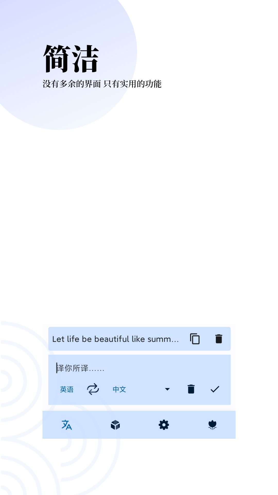
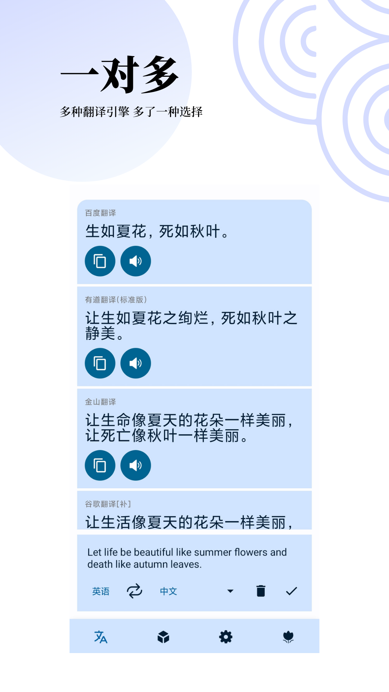
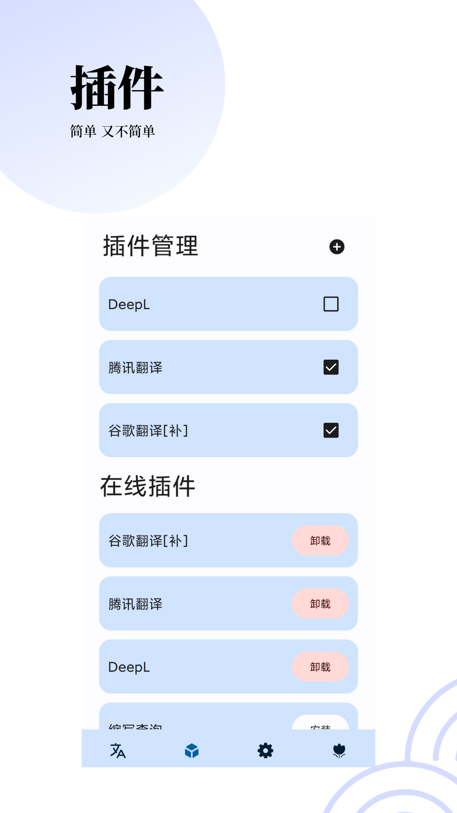
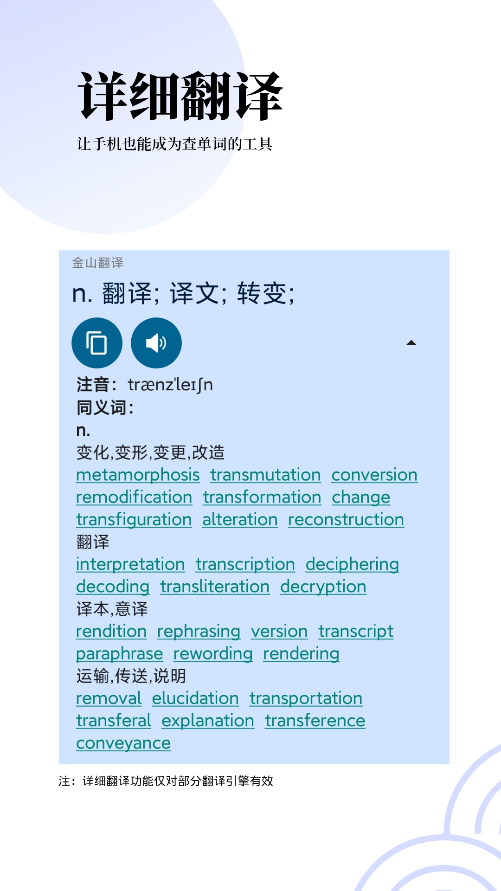

## FunnyTranslation

| [English Version](README_en.md) |

### 介绍

本软件是一款翻译软件，旧版基于Java语言，在传统View体系下开发；自2.0.0起逐步改用Kotlin开发，自2.1.0起软件架构重写，大部分代码均用Kotlin编写，页面完全改用Jetpack Compose。软件自2.1.0起决定开源、自2.6.0起因成本原因引入付费机制。**出于对开源精神的追求，到目前仍然继续保持开源**。如有帮助， **欢迎star** ！

**自 2.8.0 起迁移至 Kotlin 跨平台 （JVM + Android），对 v2.6.9 之后代码或 KMP + CMP 跨平台感兴趣的欢迎移步 [Transtation-KMP](https://github.com/FunnySaltyFish/Transtation-KMP)**

本应用有以下特点：

- Jetpack Compose + MVVM + Kotlin Coroutine + Flow + Room 
- 多 module 设计，公共模块与项目模块分离
- 支持多引擎同步翻译，支持插件开发、下载、更新、导入、导出等，高拓展性
- 充分利用 Kotlin 语言特性，如延迟懒加载、类代理、Coroutine、Flow、密闭类、拓展方法、拓展属性、反射等 
- 基于 Rhino JS 设计并实现完整的 JavaScript 插件加载、运行、调试环境，提供插件开发一条龙支持 
- 适配 Android11文件权限，适配双语、暗黑模式、横屏/平板页面，开发、使用并公开发布三个开源库

应用逐步适配 Android13，具体包括：  
- 支持单独设置应用语言
- 适配桌面单色图标

您可以在以下途径获取最新版本：
- [官网](https://www.funnysaltyfish.fun/trans/?source=github)
- [此仓库-中国大陆渠道](/translate/common/release/commonRelease.apk)
- [此仓库-GooglePlay渠道（未完成）](/translate/google/release)

考虑到本应用的Star逐渐增多，且在某些地方一定程度上作为学习的项目，我最近也在加强它“一个可参考的开源项目”的属性。  

如果您希望阅读代码，我建议您从 [主Activity](translate/src/main/java/com/funny/translation/translate/TransActivity.kt) 开始

### 截图

#### 运行截图
UI v4：
|          |          |          |
| -------- | -------- | -------- |
|  |  |  |
|  |  |  |
|  |  |          |


<details>
<summary>旧版 UI v3</summary>

| 图片                                                         | 图片                                                         |
| ------------------------------------------------------------ | ------------------------------------------------------------ |
|  |  |
|  |  |
</details>


### 源代码简介
作为开源项目来说，您可以从以下方面了解它

#### 代码风格
从代码的组织结构来说，这里面的代码并没有完全遵循 Google 的最佳实践，如果想极力追求代码的优雅，可以参考 Google 官方的 [NowInAndroid 项目](https://github.com/android/nowinandroid)。但就实际使用效果来看，那个项目因为过于追求数据流的统一，导致体验上并不非常好（比如在我体验到的版本中，列表项中的任何一个点击 “收藏”，都会触发上流的 flow 更新，从而刷新整个列表，这会导致你点击一个收藏按钮，整个列表又回到了最顶端，显然是不符合实际使用体验的）。  

代码的编写大致遵循这个规则：Composable + ViewModel，其中较为简单的逻辑直接在 Composable 中实现，较为复杂的在 ViewModel 中实现。出于**写起来的方便**，ViewModel 并里面的 State 没有采取 “内置 MutableState + 对外暴露 State” 的策略，而是将所有的 State 均设为 Mutable，并且有一部分直接通过 vm.xxx 调用。

不过，一些基本的整洁度，比如命名的基本规范、代码缩进、Kotlin 式的编程风格还是有的。主要的 ViewModel 文件和 Composable 页面，在 AS 的检查下，部分做到了全绿，绝大部分的黄色 Lint 均在 1~5 个，多为未使用的 TAG 变量，未使用的函数之类。

#### 模块

- **translate： 主体的翻译页面**
- **base-core：基础模块，定义了基本Bean，以API形式引入第三方模块提供给其他部分**
- **codeeditor：代码编辑器页面**
- **login: 登录、注册页面**
- **jet-setting-core：设置页面的基本组件**
- editor、language-base、language-universal：来源于开源项目[sora-editor](https://github.com/Rosemoe/sora-editor)，代码编辑器 View
- buildSrc：依赖版本管理

您可以参阅[此文档](./detail_introduction.md)以了解各模块详细代码组成


#### 运行前准备

- 自23年6月起，项目迁移到了 `Gradle 8` + `AGP 8`，因此您需要使用 [Android Studio](https://developer.android.google.cn/studio/)  **Flamingo | 2022.2.1 及以上版本，高度建议为最新的稳定版**

- 为了安全起见，开源部分不包括有关签名信息的`signing.properties`文件，如需打 Release 包请您补全此文件

  - **signing.properties**

  - 位于根目录下

    ```bash
    // 如果需要打release包，请在项目根目录下自行添加此文件
    /**
     *  STORE_FILE=yourAppStroe.keystore
        STORE_PASSWORD=yourStorePwd
        KEY_ALIAS=yourKeyAlias
        KEY_PASSWORD=yourAliasPwd
     */
    ```
 
   如果你在最新的稳定版 AS 上以及正确的 Gradle 版本上仍然运行不起来，确定不是自己的问题后，可以（feel free to）开 issue 来问问，有可能是我提交 git 时少了哪些文件。我会在看到后尽快回复的。

### 致谢

- 页面设计（UI v3）参考自 酷安@江戸川コナン（已授权）
- 页面设计（UI v4）和宣传图来自 酷安@松川吖
- 感谢所有赞助过项目的小伙伴们！
- 感谢所有贡献者们！

### 贡献者 ❤

<a href="https://github.com/FunnySaltyFish/FunnyTranslation/graphs/contributors">
  
</a>

如果此项目对您有帮助，欢迎不吝**Star**~

## Star History

[](https://star-history.com/#FunnySaltyFish/FunnyTranslation&Date)

