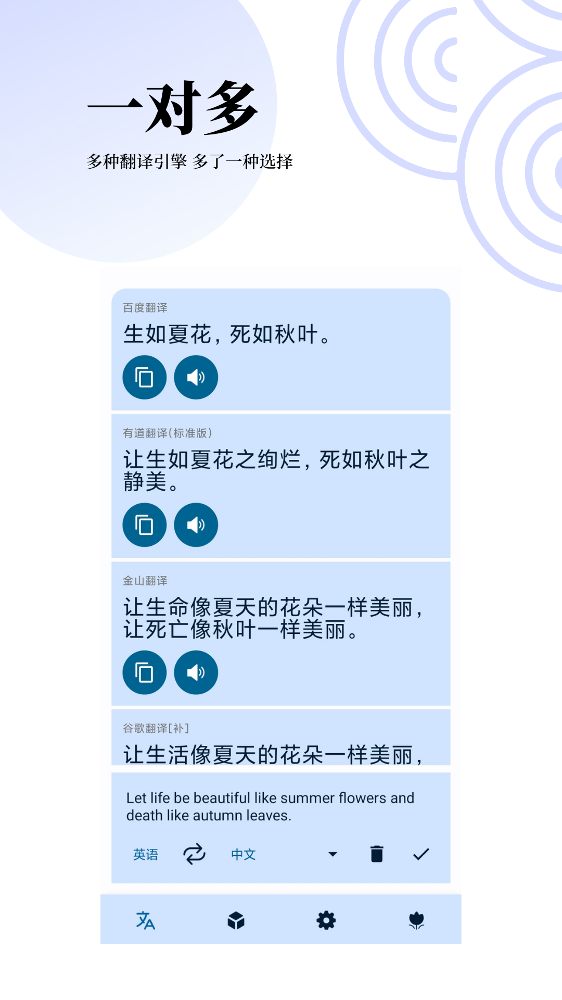
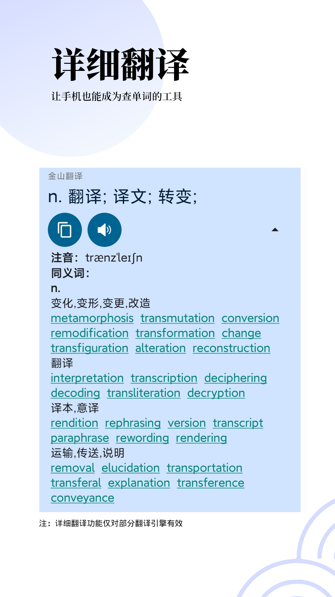

## FunnyTranslation

The English version is translated with the help of **ChatGPT**, thanks for it!

### Introduction

**This software is a translation software which mainly serves for Chinese users right now. It is also a open-source project which can be referred to when learning Jetpack Compose.** The old version is based on Java language and developed under the traditional View system. Since version 2.0.0, it gradually switched to Kotlin, and since version 2.1.0, the software architecture has been rewritten and most of the code is written in Kotlin, and the pages are completely changed to Jetpack Compose. The software has been open source since version 2.1.0.

The following are the features of this application:

- Jetpack Compose + MVVM + Kotlin Coroutine + Flow + Room
- Multi-module design, with separation between the common module and the project module
- Supports synchronized translation with multiple engines, and supports plugin development, download, update, import, export, etc. with high scalability
- Makes full use of the Kotlin language features, such as lazy loading, class proxy, Coroutine, Flow, sealed classes, extension methods, extension properties, and reflection, etc.
- Based on Rhino JS, it designs and implements a complete JavaScript plugin loading, running, and debugging environment, providing one-stop support for plugin development
- Adapts to Android11 file permissions, adapts to bilingual, dark mode, landscape/tablet pages, and develops, uses and publicly releases three open source libraries

The application gradually adapts to Android13, including:

- Supports setting the application language separately

You can get the latest version from the following ways:

- [Coolapk](https://www.coolapk.com/apk/com.funny.translation)
- [This repository](https://chat.openai.com/translate/release/translate-release.apk)

Considering that the number of stars for this application is gradually increasing, and it is used as a learning project to a certain extent, I have also been strengthening its attribute as "a referenceable open-source project".

If you want to read the code, I recommend that you start from [the main Activity](https://chat.openai.com/chat/translate/src/main/java/com/funny/translation/translate/TransActivity.kt)

If you find it helpful, **welcome to star**!

### Screenshot

#### Running Screenshot

UI v4：
|          |          |          |
| -------- | -------- | -------- |
|  |  |  |
|  |  |  |
|  |  |          |


<details>
<summary>Old UI v3</summary>

| Screenshot                                                       |Screenshot                                                         |
| ------------------------------------------------------------ | ------------------------------------------------------------ |
|  |  |
|  |  |
</details>


### Source Code Overview

As an open-source project, you can learn about it from the following aspects:

#### Code Style
In terms of code organization, the code here doesn't strictly follow Google's best practices. If you want to pursue elegant code, you can refer to Google's official [NowInAndroid project](https://github.com/android/nowinandroid). However, in terms of actual usage, that project's pursuit of unified data flow has led to suboptimal user experience (for example, in the version I experienced, clicking on "Favorite" in any list item would trigger an upstream flow update, refreshing the entire list. This would cause the list to scroll back to the top when you click a favorite button, which clearly doesn't align with the actual user experience).

The code is written following this rule: Composable + ViewModel. Simple logic is implemented directly in Composable, while more complex logic is implemented in ViewModel. For the sake of convenience, the State inside the ViewModel has not adopted the "internal MutableState + externally exposed State" strategy. Instead, all States are mutable, and some are directly accessed through `vm.xxx`.

However, there are still some basic cleanliness aspects, such as naming conventions, code indentation, and Kotlin-style programming. The main ViewModel files and Composable pages, under AS inspection, achieve full green for the most part, with the majority of yellow Lint warnings ranging from 1 to 5, mostly relating to unused TAG variables or unused functions.

#### Modules

- **translate: the main translation page**
- **base-core: the basic module, defining basic Beans, and introducing third-party modules in API form for use by other parts**
- **codeeditor: the code editor page**
- **login: the login and registration page**
- **jet-setting-core: the basic component of the settings page**
- editor, language-base, language-universal: code editor View from the open-source project [sora-editor](https://github.com/Rosemoe/sora-editor)
- buildSrc: dependency version management

You can refer to [this document(Chinese)](https://chat.openai.com/chat/detail_introduction.md) for a detailed understanding of the code composition of each module.

#### Preparation Before Running

- You need to use [Android Studio](https://developer.android.com/studio/) version **Flamingo or higher**, the newest stable version is highly recommended.

- For security reasons, the open-source part does not include the `signing.properties` file containing signature information. If you need to build a Release package, please add this file yourself.

  - **signing.properties**

  - located in the root directory

    ```bash
    // If you need to build a release package, please add this file yourself in the project root directory
    /**
     *  STORE_FILE=yourAppStroe.keystore
        STORE_PASSWORD=yourStorePwd
        KEY_ALIAS=yourKeyAlias
        KEY_PASSWORD=yourAliasPwd
     */
    ```

If you are unable to run it on the latest stable version of Android Studio and the correct Gradle version, and you have confirmed that it is not due to your own issues, feel free to open an issue and ask. It's possible that I missed some files when committing to Git. I will respond as soon as I see it.

### Acknowledgments

- UI design (v3) referenced from 酷安@江戸川コナン (authorized)
- UI design (V4) and promotional graphics from 酷安@松川吖
- Thank you to all the friends who have sponsored the project!
- Thank you to all the contributors!

### Contributors ❤

<a href="https://github.com/FunnySaltyFish/FunnyTranslation/graphs/contributors">    </a>

If this project is helpful to you, welcome to **Star** it~